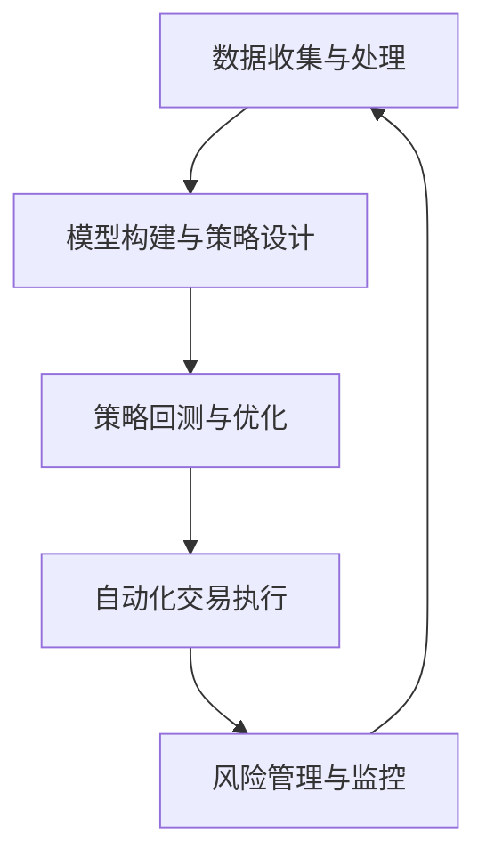

# 量化交易调研报告

## 1. 什么是量化交易？

量化交易，英文为 Quantitative Trading，是一种利用数学模型、统计分析和计算机算法来进行交易决策的投资方法。 <mcreference link="https://zhuanlan.zhihu.com/p/671157912" index="2">2</mcreference> <mcreference link="https://invest.howlifeusa.com/zh/quantitative-trading/" index="4">4</mcreference> 它依赖于大量的历史和实时数据，如市场价格、交易量和经济指标，来识别市场趋势、估值和波动性等关键因素。 <mcreference link="https://zhuanlan.zhihu.com/p/671157912" index="2">2</mcreference> 量化交易者通过复杂的数学模型分析数据和预测市场行为，并利用计算机算法根据预设的规则和模型自动执行交易。 <mcreference link="https://zhuanlan.zhihu.com/p/671157912" index="2">2</mcreference>

与依赖于个人经验和直觉的传统主观交易不同，量化交易强调数据和纪律性。 <mcreference link="https://baike.baidu.com/item/量化交易/5266581" index="1">1</mcreference> 它通过系统性的方法，将投资决策过程自动化，以减少人为情绪干扰，从而提高交易效率和准确性。 <mcreference link="https://www.caifuzhidao.com/247.html" index="2">2</mcreference>

### 1.1 量化交易的特点

量化交易主要有以下几个特点：

*   **纪律性**: 根据模型的运行结果进行决策，而不是凭感觉。这可以克制人性中贪婪、恐惧和侥幸心理等弱点。 <mcreference link="https://baike.baidu.com/item/量化交易/5266581" index="1">1</mcreference>
*   **系统性**: 具体表现为多层次、多角度、多数据。量化投资的核心思想涵盖宏观周期、市场结构、估值、成长、盈利质量、分析师盈利预测、市场情绪等多个角度。 <mcreference link="https://baike.baidu.com/item/量化交易/5266581" index="1">1</mcreference>
*   **套利思想**: 通过全面、系统性的扫描捕捉错误定价、错误估值带来的机会，从而发现估值洼地，并通过买入低估资产、卖出高估资产而获利。 <mcreference link="https://baike.baidu.com/item/量化交易/5266581" index="1">1</mcreference>
*   **概率取胜**: 不断从历史数据中挖掘有望重复的规律并加以利用，并依靠组合资产取胜，而不是单个资产取胜。 <mcreference link="https://baike.baidu.com/item/量化交易/5266581" index="1">1</mcreference>

### 1.2 量化交易的优缺点

#### 优点

*   **克服情绪、纪律投资**: 能够排除人性的贪婪、恐恐惧等主观情感，进行客观的交易。 <mcreference link="https://www.tejwin.com/insight/quantitative-trading/" index="3">3</mcreference>
*   **易于入门投资**: 对于刚入门的投资者而言，量化交易更能迅速打下投资基础。 <mcreference link="https://www.tejwin.com/insight/quantitative-trading/" index="3">3</mcreference>
*   **快速找出砂砾中的珍珠**: 能够更快筛选出合适的交易标的。 <mcreference link="https://www.tejwin.com/insight/quantitative-trading/" index="3">3</mcreference>
*   **能管理愈渐庞大的交易规模与策略**: 将盯盘与交易的工作交由机器，投资人只需负责订定策略。 <mcreference link="https://www.tejwin.com/insight/quantitative-trading/" index="3">3</mcreference>
*   **能验证自身策略**: 能透过量化交易来验证自身策略是否能盈利。 <mcreference link="https://www.tejwin.com/insight/quantitative-trading/" index="3">3</mcreference>

#### 缺点

*   **无法及时反应市场变动**: 模型基于历史数据，可能无法应对突发的市场事件。 <mcreference link="https://www.tejwin.com/insight/quantitative-trading/" index="3">3</mcreference>
*   **维护仍需时间成本**: 需要持续监控和调整策略。 <mcreference link="https://www.tejwin.com/insight/quantitative-trading/" index="3">3</mcreference>
*   **资料取得困难**: 获取高质量的数据可能需要付费。 <mcreference link="https://www.tejwin.com/insight/quantitative-trading/" index="3">3</mcreference>
*   **资金规模小较不具交易优优势**: 对于小资金规模的投资者，交易成本可能较高。 <mcreference link="https://www.tejwin.com/insight/quantitative-trading/" index="3">3</mcreference>
*   **进入门槛较高**: 需要具备编程、数学和金融等多方面的知识。 <mcreference link="https://www.tejwin.com/insight/quantitative-trading/" index="3">3</mcreference>

## 2. 常见的量化交易策略

量化交易策略多种多样，以下是一些常见的策略类型：

*   **市场中性策略 (Market Neutral)**: 该策略旨在通过同时持有多头和空头头寸来对冲市场风险，从而获得与市场走势无关的回报。 <mcreference link="https://www.tejwin.com/insight/quantitative-trading/" index="1">1</mcreference>
*   **多/空策略 (Long/Short Equity)**: 投资者同时持有多头（买入）和空头（卖出）头寸，但与市场中性策略不同，该策略通常在多头或空头方向上有净敞口。 <mcreference link="https://www.tejwin.com/insight/quantitative-trading/" index="1">1</mcreference>
*   **趋势策略 (Trend strategy)**: 趋势跟踪策略基于“趋势是你的朋友”的理念，通过技术指标（如移动平均线）识别市场趋势，并顺势交易。 <mcreference link="https://www.tejwin.com/insight/quantitative-trading/" index="1">1</mcreference>
*   **事件驱动策略 (Event Driven)**: 此类策略利用公司特定事件（如并购、财报发布、重组等）进行交易，预期这些事件将影响公司股价。 <mcreference link="https://www.tejwin.com/insight/quantitative-trading/" index="1">1</mcreference>
*   **高频交易 (High-Frequency Trading)**: HFT 是一种利用强大的计算机、复杂的算法和高速网络连接，在极短的时间内进行大量交易的策略。 <mcreference link="https://www.tejwin.com/insight/quantitative-trading/" index="1">1</mcreference>
*   **统计套利 (Statistical Arbitrage)**: 统计套利是利用资产价格的历史统计规律进行的套利，其风险在于这种历史统计规律在未来一段时间内是否继续存在。 <mcreference link="https://baike.baidu.com/item/量化交易/5266581" index="1">1</mcreference>
*   **算法交易 (Algorithmic Trading)**: 算法交易又称自动交易、黑盒交易或机器交易，是指通过设计算法，利用计算机程序发出交易指令的方法。 <mcreference link="https://baike.baidu.com/item/量化交易/5266581" index="1">1</mcreference>

## 3. 量化交易的工作流程和工具

一个完整的量化交易系统通常包括以下几个步骤：

1.  **数据收集与处理**: 广泛收集市场数据，包括股票价格、成交量、历史走势、基本面信息、市场情绪指标及宏观经济数据等。 <mcreference link="https://www.caifuzhidao.com/247.html" index="2">2</mcreference>
2.  **模型构建与策略设计**: 基于收集到的数据，运用统计学、数学、经济学等理论和方法构建模型。 <mcreference link="https://www.caifuzhidao.com/247.html" index="2">2</mcreference>
3.  **策略回测与优化**: 利用历史数据对策略进行模拟交易，以评估策略的性能和风险。 <mcreference link="https://www.caifuzhidao.com/247.html" index="2">2</mcreference>
4.  **自动化交易执行**: 将经过回测和优化的策略部署到交易系统中，实现自动化交易。 <mcreference link="https://www.caifuzhidao.com/247.html" index="2">2</mcreference>
5.  **风险管理与监控**: 设置止损点和止盈点来控制潜在的损失，同时实时监控交易情况。 <mcreference link="https://www.caifuzhidao.com/247.html" index="2">2</mcreference>

### 3.1 常用工具和平台

对于个人投资者来说，有许多工具和平台可以帮助我们进行量化交易：

*   **编程语言**: Python 是目前最流行的量化交易编程语言，拥有丰富的第三方库（如 Pandas, NumPy, Scikit-learn, TensorFlow）和活跃的社区。 <mcreference link="https://zhuanlan.zhihu.com/p/53787963" index="3">3</mcreference>
*   **量化交易平台**: 
    *   **BigQuant**: 提供AI驱动的量化平台，支持低代码甚至无代码的策略开发。 <mcreference link="https://www.cnblogs.com/budaomudesanye/p/17359849.html" index="4">4</mcreference>
    *   **聚宽 (JoinQuant)**: 国内知名的量化交易平台，提供丰富的数据、回测功能和社区支持。 <mcreference link="https://www.cnblogs.com/budaomudesanye/p/17359849.html" index="4">4</mcreference>
    *   **VNPY**: 一个开源的Python量化交易框架，适合有一定开发经验的投资者进行二次开发。 <mcreference link="https://www.cnblogs.com/budaomudesanye/p/17359849.html" index="4">4</mcreference>
*   **券商API**: 许多券商（如盈透证券、富途证券）提供API接口，允许投资者将自己的交易系统与券商的交易通道对接，实现自动化交易。 <mcreference link="https://invest.howlifeusa.com/zh/quantitative-trading/" index="4">4</mcreference>

## 4. 个人投资者的实践思路

对于希望入门量化交易的个人投资者，以下是一些实践思路和建议：

### 4.1 从简单策略开始

不要一开始就追求复杂的高频交易或套利策略。可以从一些经典的、容易理解的策略入手，例如：

*   **双均线策略**:
    *   **逻辑**: 当短期移动平均线（如5日均线）上穿长期移动平均线（如20日均线）时，产生买入信号（金叉）。
    *   **逻辑**: 当短期移动平均线下穿长期移动平均线时，产生卖出信号（死叉）。
    *   **优点**: 简单易懂，是学习趋势跟踪策略的绝佳起点。

*   **RSI 指标策略**:
    *   **逻辑**: 相对强弱指数（RSI）是一个动量指标，衡量价格变动的速度和变化。
    *   **交易信号**: 当 RSI 低于某个阈值（如30）时，表示市场可能超卖，是潜在的买入机会。当 RSI 高于某个阈值（如70）时，表示市场可能超买，是潜在的卖出机会。

### 4.2 选择合适的工具

*   **初学者**: 可以先使用像 **聚宽 (JoinQuant)** 或 **BigQuant** 这样的在线平台。它们提供了友好的用户界面、免费的历史数据和内置的回测引擎，可以让你快速验证自己的策略想法，而无需搭建复杂的本地环境。
*   **有编程基础的投资者**: 可以尝试使用 **Python** 配合 `pandas`、`numpy` 和 `matplotlib` 等库进行本地的回测分析。当策略成熟后，可以考虑使用 **VNPY** 这样的开源框架，并对接券商的真实交易API。

### 4.3 严格的回测与模拟交易

*   **历史数据回测**: 这是检验策略有效性的第一步。你需要使用足够长的历史数据来测试你的策略，并评估其夏普比率、最大回撤、年化收益率等关键绩效指标。警惕过度拟合（Overfitting），即策略在历史数据上表现完美，但在未来数据上表现糟糕。
*   **模拟交易 (Paper Trading)**: 在将真实资金投入之前，务必进行模拟交易。这可以帮助你在一个无风险的环境中，检验策略在真实市场环境下的表现，并熟悉交易执行的各个环节。

### 4.4 持续学习和优化

量化交易不是一劳永逸的。市场在不断变化，有效的策略可能会逐渐失效。因此，你需要：

*   **不断学习**: 关注新的金融理论、算法和市场动态。
*   **监控策略表现**: 定期检查你的策略表现，如果发现其性能下降，需要及时分析原因。
*   **优化和迭代**: 根据市场变化和策略表现，不断调整和优化你的模型。

### 4.5 风险管理至上

任何交易策略都离不开严格的风险管理。

*   **设置止损**: 为每笔交易设置明确的止损点，以控制单笔交易的最大亏损。
*   **资金管理**: 合理分配你的资金，不要在单笔交易或单个策略上投入过多的资金。
*   **分散投资**: 考虑构建一个由多个弱相关策略组成的投资组合，以分散风险。

## 5. 总结

量化交易作为一种高度依赖数据和模型的投资方法，为投资者提供了一个系统化、纪律化的决策框架。它通过消除情绪偏见和利用计算能力，在复杂的金融市场中寻找盈利机会。从市场中性策略到高频交易，从简单的双均线模型到复杂的人工智能算法，量化交易的世界广阔而深邃。

对于个人投资者而言，量化交易并非遥不可及。借助 Python 等强大的编程语言、聚宽等成熟的在线平台以及券商提供的 API，个人完全有能力构建、回测和部署自己的交易策略。然而，成功并非易事。它需要投资者具备编程、数学、金融等多方面的知识，并保持持续学习的热情，以应对不断变化的市场。

更重要的是，所有量化交易者都必须将风险管理放在首位。没有完美的策略，市场也永远充满了不确定性。只有通过严格的资金管理、止损设置和策略分散，才能在这场概率的游戏中行稳致远。

希望本报告能为您提供一个关于量化交易的清晰蓝图，并为您的实践之路点亮一盏明灯。